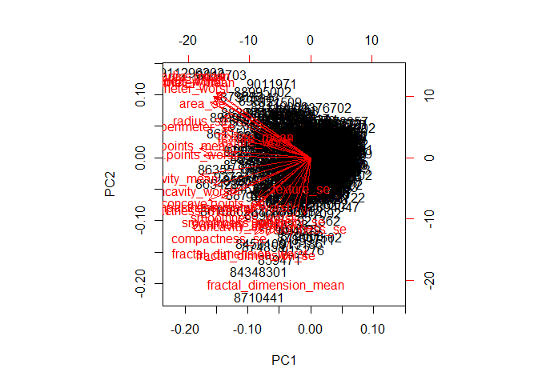

Class 9: Unsupervised Learning II
================
Quoc Tran
April 30, 2019

\#\#Preparing the data

``` r
wisc.df <- read.csv("WisconsinCancer.csv")

wisc.data <- as.matrix(wisc.df[,c(3:32)], nrow=nrow(wisc.df), ncol=30)
rownames(wisc.data) <- wisc.df$id

diagnosis <- wisc.df$diagnosis
diagnosis <- as.numeric(diagnosis=="M")
```

\#\#Exploratory data analysis Q1. How many observations are in this
dataset?

``` r
nrow(wisc.data)
```

    ## [1] 569

Q2. How many variables/features in the data are suffixed with \_mean?

``` r
length(grep("_mean", colnames(wisc.data)))
```

    ## [1] 10

Q3. How many of the observations have a malignant diagnosis?

``` r
sum(diagnosis)
```

    ## [1] 212

\#\#Performing PCA

``` r
wisc.pr <- prcomp(wisc.data, scale.=TRUE)
summary(wisc.pr)
```

    ## Importance of components:
    ##                           PC1    PC2     PC3     PC4     PC5     PC6
    ## Standard deviation     3.6444 2.3857 1.67867 1.40735 1.28403 1.09880
    ## Proportion of Variance 0.4427 0.1897 0.09393 0.06602 0.05496 0.04025
    ## Cumulative Proportion  0.4427 0.6324 0.72636 0.79239 0.84734 0.88759
    ##                            PC7     PC8    PC9    PC10   PC11    PC12
    ## Standard deviation     0.82172 0.69037 0.6457 0.59219 0.5421 0.51104
    ## Proportion of Variance 0.02251 0.01589 0.0139 0.01169 0.0098 0.00871
    ## Cumulative Proportion  0.91010 0.92598 0.9399 0.95157 0.9614 0.97007
    ##                           PC13    PC14    PC15    PC16    PC17    PC18
    ## Standard deviation     0.49128 0.39624 0.30681 0.28260 0.24372 0.22939
    ## Proportion of Variance 0.00805 0.00523 0.00314 0.00266 0.00198 0.00175
    ## Cumulative Proportion  0.97812 0.98335 0.98649 0.98915 0.99113 0.99288
    ##                           PC19    PC20   PC21    PC22    PC23   PC24
    ## Standard deviation     0.22244 0.17652 0.1731 0.16565 0.15602 0.1344
    ## Proportion of Variance 0.00165 0.00104 0.0010 0.00091 0.00081 0.0006
    ## Cumulative Proportion  0.99453 0.99557 0.9966 0.99749 0.99830 0.9989
    ##                           PC25    PC26    PC27    PC28    PC29    PC30
    ## Standard deviation     0.12442 0.09043 0.08307 0.03987 0.02736 0.01153
    ## Proportion of Variance 0.00052 0.00027 0.00023 0.00005 0.00002 0.00000
    ## Cumulative Proportion  0.99942 0.99969 0.99992 0.99997 1.00000 1.00000

Q4. From your results, what proportion of the original variance is
captured by the first principal components (PC1)?

0.4427

Q5. How many principal components (PCs) are required to describe at
least 70% of the original variance in the data?

3 principal components (0.72636)

Q6. How many principal components (PCs) are required to describe at
least 90% of the original variance in the data?

7 principal components (0.91010)

\#\#Interpreting PCA Results

``` r
biplot(wisc.pr)
```

<!-- -->

Q7. What stands out to you about this plot? Is it easy or difficult to
understand? Why?

It’s very messy and very hard to understand because all of the principal
components and all of the data points are being plotted.

**PC1 vs PC2 (red = malignant)**

``` r
plot(wisc.pr$x[,1:2], col=(diagnosis+1), xlab="PC1", ylab="PC2")
```

<!-- -->

**PC1 vs PC3 (red = malignant)**

``` r
plot(wisc.pr$x[,c(1,3)], col=(diagnosis+1), xlab="PC1", ylab="PC3")
```

<!-- -->

Q8. Generate a similar plot for principal components 1 and 3. What do
you notice about these plots?

There is a clear delineation between malignant and benign tumors along
principal component 1.

\#\#Variance explained

``` r
pr.var <- wisc.pr$sdev^2 # standard deviation squared = variation
pve <- pr.var/sum(pr.var) # proportion of variance
plot(pve, xlab="Principal Component", ylab="Proportion of Variance Explained", ylim=c(0,1), typ="o", main="Scree Plot")
```

<!-- -->

``` r
plot(cumsum(pve), xlab="Principal Component", ylab="Cumulative Proportion of Variance Explained", ylim=c(0,1), typ="o", main="Scree Plot")
```

<!-- -->

\#\#Communicating PCA Results

Q9. For the first principal component, what is the component of the
loading vector (i.e. wisc.pr$rotation\[,1\]) for the feature
concave.points\_mean?

``` r
wisc.pr$rotation[,(colnames(wisc.data) == "concave.points_mean")]
```

    ##             radius_mean            texture_mean          perimeter_mean 
    ##             0.007452296            -0.130674825             0.018687258 
    ##               area_mean         smoothness_mean        compactness_mean 
    ##            -0.034673604             0.288974575             0.151396350 
    ##          concavity_mean     concave.points_mean           symmetry_mean 
    ##             0.072827285             0.152322414             0.231530989 
    ##  fractal_dimension_mean               radius_se              texture_se 
    ##             0.177121441            -0.022539967             0.475413139 
    ##            perimeter_se                 area_se           smoothness_se 
    ##             0.011896690            -0.085805135            -0.573410232 
    ##          compactness_se            concavity_se       concave.points_se 
    ##            -0.117460157            -0.060566501             0.108319309 
    ##             symmetry_se    fractal_dimension_se            radius_worst 
    ##            -0.220149279            -0.011168188            -0.042619416 
    ##           texture_worst         perimeter_worst              area_worst 
    ##            -0.036251636            -0.030558534            -0.079394246 
    ##        smoothness_worst       compactness_worst         concavity_worst 
    ##            -0.205852191            -0.084019659            -0.072467871 
    ##    concave.points_worst          symmetry_worst fractal_dimension_worst 
    ##             0.036170795            -0.228225053            -0.048360667

Q10. What is the minimum number of principal components required to
explain 80% of the variance of the data?

``` r
pc.min <- 0
index <- 1
while (pc.min < 0.8) {
  pc.min <- pc.min + pve[index]
  index = index + 1
}
paste(index-1, "principal components are required to explain", round(pc.min*100, 1), "% of the data.")
```

    ## [1] "5 principal components are required to explain 84.7 % of the data."

\#\#Hierarchical clustering of case data

``` r
data.scaled <- scale(wisc.data)
data.dist <- dist(data.scaled)
wisc.hclust <- hclust(data.dist, method="complete")
```

Q11. Using the plot() and abline() functions, what is the height at
which the clustering model has 4 clusters?

``` r
plot(wisc.hclust)
abline(h=19, col="red")
```

<!-- -->

\#\#Selecting number of clusters

``` r
wisc.hclust.clusters <- cutree(wisc.hclust, k=4)
table(wisc.hclust.clusters, diagnosis)
```

    ##                     diagnosis
    ## wisc.hclust.clusters   0   1
    ##                    1  12 165
    ##                    2   2   5
    ##                    3 343  40
    ##                    4   0   2

Q12. Can you find a better cluster vs diagnoses match with by cutting
into a different number of clusters between 2 and 10?

``` r
for (i in c(2:10)) {
  wisc.hclust.clusters <- cutree(wisc.hclust, k=i)
  table(wisc.hclust.clusters, diagnosis)
}
wisc.hclust.clusters <- cutree(wisc.hclust, k=4) # back to normal
```

\#\#K-means clustering and comparing results

``` r
wisc.km <- kmeans(scale(wisc.data), centers=2, nstart=20)
table(wisc.km$cluster, diagnosis)
```

    ##    diagnosis
    ##       0   1
    ##   1 343  37
    ##   2  14 175

``` r
table(wisc.km$cluster, wisc.hclust.clusters)
```

    ##    wisc.hclust.clusters
    ##       1   2   3   4
    ##   1  17   0 363   0
    ##   2 160   7  20   2

\#\#Clustering on PCA results

``` r
pc.min <- 0
index <- 1
while (pc.min < 0.9) {
  pc.min <- pc.min + pve[index]
  index = index + 1
}
paste(index-1, "principal components are required to explain", round(pc.min*100, 1), "% of the data.")
```

    ## [1] "7 principal components are required to explain 91 % of the data."

``` r
data.dist <- dist(wisc.pr$x[,1:7])
wisc.pr.hclust <- hclust(data.dist, method="ward.D2")
plot(wisc.pr.hclust)
```

<!-- -->

**PC1 vs PC2 (red = group2**

``` r
grps <- cutree(wisc.pr.hclust, k=2)
table(grps)
```

    ## grps
    ##   1   2 
    ## 216 353

``` r
table(grps, diagnosis)
```

    ##     diagnosis
    ## grps   0   1
    ##    1  28 188
    ##    2 329  24

``` r
plot(wisc.pr$x[,1:2], col=grps)
```

<!-- -->

## Sensitivity/Specificity

Q16. Which of your analysis procedures resulted in a clustering model
with the best specificity? How about sensitivity?

Best specificity: hclust

Best sensitivity: kmeans

## Prediction

``` r
new <- read.csv("new_samples.csv")
npc <- predict(wisc.pr, newdata=new)
plot(wisc.pr$x[,1:2], col=grps)
points(npc[,1], npc[,2], col="blue", pch=16, main="blue = new patients")
```

<!-- -->

Q17. Which of these new patients should we prioritize for follow up
based on your results?

We should prioritize Patient 1 (rightmost blue point) for follow up.
