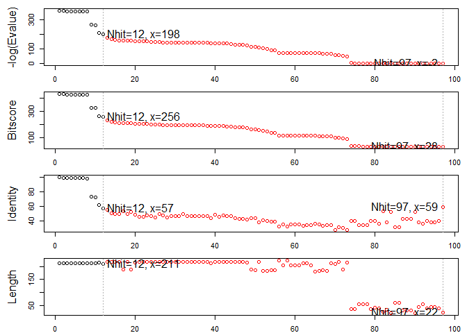
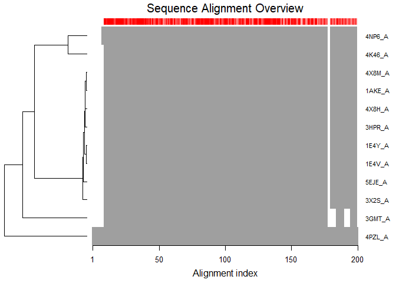
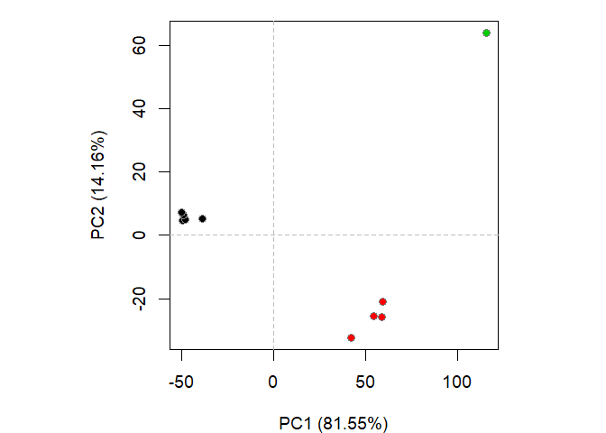

Lecture 11: Structural Bioinformatics I
================
Quoc Tran
5/7/2019

## Question 1

Download a CSV file from the PDB site (accessible from “Analyze” -\>
“PDB Statistics” \> “by Experimental Method and Molecular Type”. Move
this CSV file into your RStudio project and determine the percentage of
structures solved by X-Ray and Electron Microscopy. From the website
what proportion of structures are protein?

``` r
pdbStats <- read.csv("data.csv", header=TRUE)
pdbStats
```

    ##   Experimental.Method Proteins Nucleic.Acids Protein.NA.Complex Other
    ## 1               X-Ray   126880          2012               6547     8
    ## 2                 NMR    11062          1279                259     8
    ## 3 Electron Microscopy     2277            31                800     0
    ## 4               Other      256             4                  6    13
    ## 5        Multi Method      129             5                  2     1
    ##    Total
    ## 1 135447
    ## 2  12608
    ## 3   3108
    ## 4    279
    ## 5    137

``` r
print(paste(round(sum(pdbStats$Total[1]) / sum(pdbStats$Total) * 100), "% of structures are from X-Ray Crystallography"))
```

    ## [1] "89 % of structures are from X-Ray Crystallography"

``` r
print(paste(round(sum(pdbStats$Total[3]) / sum(pdbStats$Total) * 100), "% of structures are from Electron Microscopy"))
```

    ## [1] "2 % of structures are from Electron Microscopy"

``` r
print(paste(round(sum(pdbStats$Proteins) / sum(pdbStats$Total) * 100), "% of structures are proteins."))
```

    ## [1] "93 % of structures are proteins."

## Question 2

Type HIV in the PDB website search box on the home page and determine
how many HIV-1 protease structures are in the current PDB?

1157 HIV-1 Proteases in PDB as of 2019-05-07:
<http://www.rcsb.org/pdb/results/results.do?tabtoshow=Current&qrid=5C72D346>

# Section3: Introduction to Bio3D in R

``` r
library(bio3d)
pdb <- read.pdb("1HSG")
```

    ##   Note: Accessing on-line PDB file

``` r
pdb
```

    ## 
    ##  Call:  read.pdb(file = "1HSG")
    ## 
    ##    Total Models#: 1
    ##      Total Atoms#: 1686,  XYZs#: 5058  Chains#: 2  (values: A B)
    ## 
    ##      Protein Atoms#: 1514  (residues/Calpha atoms#: 198)
    ##      Nucleic acid Atoms#: 0  (residues/phosphate atoms#: 0)
    ## 
    ##      Non-protein/nucleic Atoms#: 172  (residues: 128)
    ##      Non-protein/nucleic resid values: [ HOH (127), MK1 (1) ]
    ## 
    ##    Protein sequence:
    ##       PQITLWQRPLVTIKIGGQLKEALLDTGADDTVLEEMSLPGRWKPKMIGGIGGFIKVRQYD
    ##       QILIEICGHKAIGTVLVGPTPVNIIGRNLLTQIGCTLNFPQITLWQRPLVTIKIGGQLKE
    ##       ALLDTGADDTVLEEMSLPGRWKPKMIGGIGGFIKVRQYDQILIEICGHKAIGTVLVGPTP
    ##       VNIIGRNLLTQIGCTLNF
    ## 
    ## + attr: atom, xyz, seqres, helix, sheet,
    ##         calpha, remark, call

## Q6. How many amino acid residues are there in this pdb object and what are the two nonprotein residues?

``` r
length(pdb$seqres)
```

    ## [1] 198

## Q7. What type of R object is pdb$atom?

``` r
str(pdb$atom)
```

    ## 'data.frame':    1686 obs. of  16 variables:
    ##  $ type  : chr  "ATOM" "ATOM" "ATOM" "ATOM" ...
    ##  $ eleno : int  1 2 3 4 5 6 7 8 9 10 ...
    ##  $ elety : chr  "N" "CA" "C" "O" ...
    ##  $ alt   : chr  NA NA NA NA ...
    ##  $ resid : chr  "PRO" "PRO" "PRO" "PRO" ...
    ##  $ chain : chr  "A" "A" "A" "A" ...
    ##  $ resno : int  1 1 1 1 1 1 1 2 2 2 ...
    ##  $ insert: chr  NA NA NA NA ...
    ##  $ x     : num  29.4 30.3 29.8 28.6 30.5 ...
    ##  $ y     : num  39.7 38.7 38.1 38.3 37.5 ...
    ##  $ z     : num  5.86 5.32 4.02 3.68 6.34 ...
    ##  $ o     : num  1 1 1 1 1 1 1 1 1 1 ...
    ##  $ b     : num  38.1 40.6 42.6 43.4 37.9 ...
    ##  $ segid : chr  NA NA NA NA ...
    ##  $ elesy : chr  "N" "C" "C" "O" ...
    ##  $ charge: chr  NA NA NA NA ...

``` r
dim(pdb$atom)
```

    ## [1] 1686   16

## Q8. Use the Bio3D write.pdb() function to write out a protein only PDB file for viewing in VMD. Also write out a second separate PDB file for the ligand with residue name MK1

``` r
prot.pdb <- atom.select(pdb, "protein", value=TRUE)
write.pdb(prot.pdb, file="1hsg_protein.pdb")
lig.pdb <- atom.select(pdb, "ligand", value=TRUE)
write.pdb(lig.pdb, file="1hsg_ligand.pdb")
```

# Section 5: Example Application on Adenylate Kinase (Adk)

``` r
aa <- get.seq("1ake_A")
```

    ## Warning in get.seq("1ake_A"): Removing existing file: seqs.fasta

``` r
# Blast or hmmer search
b <- blast.pdb(aa)
```

    ##  Searching ... please wait (updates every 5 seconds) RID = FDC121HP015 
    ##  .
    ##  Reporting 97 hits

``` r
# Plot a summary of search results
hits <- plot(b)
```

    ##   * Possible cutoff values:    197 -3 
    ##             Yielding Nhits:    12 97 
    ## 
    ##   * Chosen cutoff value of:    197 
    ##             Yielding Nhits:    12

<!-- -->

``` r
head(hits$pdb.id)
```

    ## [1] "1AKE_A" "4X8M_A" "4X8H_A" "3HPR_A" "1E4V_A" "5EJE_A"

``` r
# Fetch PDBs
files <- get.pdb(hits$pdb.id, path="pdbs", split=TRUE, gzip=TRUE)
```

    ## Warning in get.pdb(hits$pdb.id, path = "pdbs", split = TRUE, gzip = TRUE):
    ## pdbs/1AKE.pdb exists. Skipping download

    ## Warning in get.pdb(hits$pdb.id, path = "pdbs", split = TRUE, gzip = TRUE):
    ## pdbs/4X8M.pdb exists. Skipping download

    ## Warning in get.pdb(hits$pdb.id, path = "pdbs", split = TRUE, gzip = TRUE):
    ## pdbs/4X8H.pdb exists. Skipping download

    ## Warning in get.pdb(hits$pdb.id, path = "pdbs", split = TRUE, gzip = TRUE):
    ## pdbs/3HPR.pdb exists. Skipping download

    ## Warning in get.pdb(hits$pdb.id, path = "pdbs", split = TRUE, gzip = TRUE):
    ## pdbs/1E4V.pdb exists. Skipping download

    ## Warning in get.pdb(hits$pdb.id, path = "pdbs", split = TRUE, gzip = TRUE):
    ## pdbs/5EJE.pdb exists. Skipping download

    ## Warning in get.pdb(hits$pdb.id, path = "pdbs", split = TRUE, gzip = TRUE):
    ## pdbs/1E4Y.pdb exists. Skipping download

    ## Warning in get.pdb(hits$pdb.id, path = "pdbs", split = TRUE, gzip = TRUE):
    ## pdbs/3X2S.pdb exists. Skipping download

    ## Warning in get.pdb(hits$pdb.id, path = "pdbs", split = TRUE, gzip = TRUE):
    ## pdbs/4K46.pdb exists. Skipping download

    ## Warning in get.pdb(hits$pdb.id, path = "pdbs", split = TRUE, gzip = TRUE):
    ## pdbs/4NP6.pdb exists. Skipping download

    ## Warning in get.pdb(hits$pdb.id, path = "pdbs", split = TRUE, gzip = TRUE):
    ## pdbs/3GMT.pdb exists. Skipping download

    ## Warning in get.pdb(hits$pdb.id, path = "pdbs", split = TRUE, gzip = TRUE):
    ## pdbs/4PZL.pdb exists. Skipping download

    ## 
      |                                                                       
      |                                                                 |   0%
      |                                                                       
      |=====                                                            |   8%
      |                                                                       
      |===========                                                      |  17%
      |                                                                       
      |================                                                 |  25%
      |                                                                       
      |======================                                           |  33%
      |                                                                       
      |===========================                                      |  42%
      |                                                                       
      |================================                                 |  50%
      |                                                                       
      |======================================                           |  58%
      |                                                                       
      |===========================================                      |  67%
      |                                                                       
      |=================================================                |  75%
      |                                                                       
      |======================================================           |  83%
      |                                                                       
      |============================================================     |  92%
      |                                                                       
      |=================================================================| 100%

``` r
# Align structures
pdbs <- pdbaln(files)
```

    ## Reading PDB files:
    ## pdbs/split_chain/1AKE_A.pdb
    ## pdbs/split_chain/4X8M_A.pdb
    ## pdbs/split_chain/4X8H_A.pdb
    ## pdbs/split_chain/3HPR_A.pdb
    ## pdbs/split_chain/1E4V_A.pdb
    ## pdbs/split_chain/5EJE_A.pdb
    ## pdbs/split_chain/1E4Y_A.pdb
    ## pdbs/split_chain/3X2S_A.pdb
    ## pdbs/split_chain/4K46_A.pdb
    ## pdbs/split_chain/4NP6_A.pdb
    ## pdbs/split_chain/3GMT_A.pdb
    ## pdbs/split_chain/4PZL_A.pdb
    ##    PDB has ALT records, taking A only, rm.alt=TRUE
    ## ...   PDB has ALT records, taking A only, rm.alt=TRUE
    ## ..   PDB has ALT records, taking A only, rm.alt=TRUE
    ## ...   PDB has ALT records, taking A only, rm.alt=TRUE
    ## ....
    ## 
    ## Extracting sequences
    ## 
    ## pdb/seq: 1   name: pdbs/split_chain/1AKE_A.pdb 
    ##    PDB has ALT records, taking A only, rm.alt=TRUE
    ## pdb/seq: 2   name: pdbs/split_chain/4X8M_A.pdb 
    ## pdb/seq: 3   name: pdbs/split_chain/4X8H_A.pdb 
    ## pdb/seq: 4   name: pdbs/split_chain/3HPR_A.pdb 
    ##    PDB has ALT records, taking A only, rm.alt=TRUE
    ## pdb/seq: 5   name: pdbs/split_chain/1E4V_A.pdb 
    ## pdb/seq: 6   name: pdbs/split_chain/5EJE_A.pdb 
    ##    PDB has ALT records, taking A only, rm.alt=TRUE
    ## pdb/seq: 7   name: pdbs/split_chain/1E4Y_A.pdb 
    ## pdb/seq: 8   name: pdbs/split_chain/3X2S_A.pdb 
    ## pdb/seq: 9   name: pdbs/split_chain/4K46_A.pdb 
    ##    PDB has ALT records, taking A only, rm.alt=TRUE
    ## pdb/seq: 10   name: pdbs/split_chain/4NP6_A.pdb 
    ## pdb/seq: 11   name: pdbs/split_chain/3GMT_A.pdb 
    ## pdb/seq: 12   name: pdbs/split_chain/4PZL_A.pdb

``` r
# Vector containing PDB codes
ids <- basename.pdb(pdbs$id)
# Draw schematic alignment
plot(pdbs, labels=ids)
```

<!-- -->

``` r
# Calculate sequence conservation
cons <- conserv(pdbs, method="entropy22")
# SSE annotations
sse <- pdbs2sse(pdbs, ind=1, rm.gaps=FALSE)
```

    ## Extracting SSE from pdbs$sse attribute

``` r
# Plot conservation per residue
plotb3(cons, sse=sse, ylab="Sequence entropy")
```

<!-- -->

``` r
library(XML)
library(RCurl)
```

    ## Loading required package: bitops

``` r
anno <- pdb.annotate(ids)
```

    ## Warning in pdb.annotate(ids): ids should be standard 4 character PDB-IDs:
    ## trying first 4 characters...

``` r
print(unique(anno$source))
```

    ## [1] "Escherichia coli"          "Photobacterium profundum" 
    ## [3] "Vibrio cholerae"           "Burkholderia pseudomallei"
    ## [5] "Francisella tularensis"

``` r
# find invariant core
core <- core.find(pdbs)
```

    ##  core size 203 of 204  vol = 968.435 
    ##  core size 202 of 204  vol = 929.83 
    ##  core size 201 of 204  vol = 896.725 
    ##  core size 200 of 204  vol = 870.563 
    ##  core size 199 of 204  vol = 842.313 
    ##  core size 198 of 204  vol = 818.551 
    ##  core size 197 of 204  vol = 789.425 
    ##  core size 196 of 204  vol = 758.485 
    ##  core size 195 of 204  vol = 733.831 
    ##  core size 194 of 204  vol = 707.91 
    ##  core size 193 of 204  vol = 680.579 
    ##  core size 192 of 204  vol = 652.935 
    ##  core size 191 of 204  vol = 627.823 
    ##  core size 190 of 204  vol = 606.714 
    ##  core size 189 of 204  vol = 589.891 
    ##  core size 188 of 204  vol = 568.49 
    ##  core size 187 of 204  vol = 548.134 
    ##  core size 186 of 204  vol = 525.13 
    ##  core size 185 of 204  vol = 503.515 
    ##  core size 184 of 204  vol = 481.666 
    ##  core size 183 of 204  vol = 461.273 
    ##  core size 182 of 204  vol = 440.71 
    ##  core size 181 of 204  vol = 417.769 
    ##  core size 180 of 204  vol = 397.549 
    ##  core size 179 of 204  vol = 379.747 
    ##  core size 178 of 204  vol = 363.953 
    ##  core size 177 of 204  vol = 350.568 
    ##  core size 176 of 204  vol = 335.769 
    ##  core size 175 of 204  vol = 321.06 
    ##  core size 174 of 204  vol = 308.453 
    ##  core size 173 of 204  vol = 297.263 
    ##  core size 172 of 204  vol = 284.751 
    ##  core size 171 of 204  vol = 273.174 
    ##  core size 170 of 204  vol = 265.125 
    ##  core size 169 of 204  vol = 254.902 
    ##  core size 168 of 204  vol = 241.569 
    ##  core size 167 of 204  vol = 231.662 
    ##  core size 166 of 204  vol = 221.509 
    ##  core size 165 of 204  vol = 216.205 
    ##  core size 164 of 204  vol = 205.327 
    ##  core size 163 of 204  vol = 197.846 
    ##  core size 162 of 204  vol = 191.037 
    ##  core size 161 of 204  vol = 183.505 
    ##  core size 160 of 204  vol = 177.354 
    ##  core size 159 of 204  vol = 171.638 
    ##  core size 158 of 204  vol = 166.758 
    ##  core size 157 of 204  vol = 161.865 
    ##  core size 156 of 204  vol = 154.239 
    ##  core size 155 of 204  vol = 149.433 
    ##  core size 154 of 204  vol = 144.722 
    ##  core size 153 of 204  vol = 137.613 
    ##  core size 152 of 204  vol = 132.143 
    ##  core size 151 of 204  vol = 125.562 
    ##  core size 150 of 204  vol = 119.529 
    ##  core size 149 of 204  vol = 115.309 
    ##  core size 148 of 204  vol = 110.573 
    ##  core size 147 of 204  vol = 105.894 
    ##  core size 146 of 204  vol = 101.137 
    ##  core size 145 of 204  vol = 96.354 
    ##  core size 144 of 204  vol = 92.483 
    ##  core size 143 of 204  vol = 88.47 
    ##  core size 142 of 204  vol = 84.192 
    ##  core size 141 of 204  vol = 80.766 
    ##  core size 140 of 204  vol = 77.906 
    ##  core size 139 of 204  vol = 75.008 
    ##  core size 138 of 204  vol = 72.256 
    ##  core size 137 of 204  vol = 69.963 
    ##  core size 136 of 204  vol = 67.62 
    ##  core size 135 of 204  vol = 65.623 
    ##  core size 134 of 204  vol = 62.213 
    ##  core size 133 of 204  vol = 60.378 
    ##  core size 132 of 204  vol = 58.229 
    ##  core size 131 of 204  vol = 56.776 
    ##  core size 130 of 204  vol = 54.987 
    ##  core size 129 of 204  vol = 53.551 
    ##  core size 128 of 204  vol = 52.026 
    ##  core size 127 of 204  vol = 49.887 
    ##  core size 126 of 204  vol = 48.589 
    ##  core size 125 of 204  vol = 46.699 
    ##  core size 124 of 204  vol = 44.676 
    ##  core size 123 of 204  vol = 42.571 
    ##  core size 122 of 204  vol = 40.6 
    ##  core size 121 of 204  vol = 38.353 
    ##  core size 120 of 204  vol = 36.254 
    ##  core size 119 of 204  vol = 34.545 
    ##  core size 118 of 204  vol = 32.536 
    ##  core size 117 of 204  vol = 31.051 
    ##  core size 116 of 204  vol = 29.587 
    ##  core size 115 of 204  vol = 28.793 
    ##  core size 114 of 204  vol = 28.046 
    ##  core size 113 of 204  vol = 27.305 
    ##  core size 112 of 204  vol = 26.559 
    ##  core size 111 of 204  vol = 25.716 
    ##  core size 110 of 204  vol = 24.943 
    ##  core size 109 of 204  vol = 24.088 
    ##  core size 108 of 204  vol = 23.13 
    ##  core size 107 of 204  vol = 22.26 
    ##  core size 106 of 204  vol = 21.287 
    ##  core size 105 of 204  vol = 20.498 
    ##  core size 104 of 204  vol = 19.653 
    ##  core size 103 of 204  vol = 19.03 
    ##  core size 102 of 204  vol = 18.384 
    ##  core size 101 of 204  vol = 17.716 
    ##  core size 100 of 204  vol = 17.054 
    ##  core size 99 of 204  vol = 16.541 
    ##  core size 98 of 204  vol = 16.004 
    ##  core size 97 of 204  vol = 15.332 
    ##  core size 96 of 204  vol = 14.675 
    ##  core size 95 of 204  vol = 14.103 
    ##  core size 94 of 204  vol = 13.534 
    ##  core size 93 of 204  vol = 12.943 
    ##  core size 92 of 204  vol = 12.36 
    ##  core size 91 of 204  vol = 11.806 
    ##  core size 90 of 204  vol = 11.287 
    ##  core size 89 of 204  vol = 10.762 
    ##  core size 88 of 204  vol = 10.282 
    ##  core size 87 of 204  vol = 9.81 
    ##  core size 86 of 204  vol = 9.383 
    ##  core size 85 of 204  vol = 8.99 
    ##  core size 84 of 204  vol = 8.627 
    ##  core size 83 of 204  vol = 8.288 
    ##  core size 82 of 204  vol = 7.937 
    ##  core size 81 of 204  vol = 7.611 
    ##  core size 80 of 204  vol = 7.287 
    ##  core size 79 of 204  vol = 7.013 
    ##  core size 78 of 204  vol = 6.759 
    ##  core size 77 of 204  vol = 6.493 
    ##  core size 76 of 204  vol = 6.231 
    ##  core size 75 of 204  vol = 5.974 
    ##  core size 74 of 204  vol = 5.682 
    ##  core size 73 of 204  vol = 5.399 
    ##  core size 72 of 204  vol = 5.117 
    ##  core size 71 of 204  vol = 4.872 
    ##  core size 70 of 204  vol = 4.659 
    ##  core size 69 of 204  vol = 4.447 
    ##  core size 68 of 204  vol = 4.288 
    ##  core size 67 of 204  vol = 4.115 
    ##  core size 66 of 204  vol = 3.923 
    ##  core size 65 of 204  vol = 3.742 
    ##  core size 64 of 204  vol = 3.535 
    ##  core size 63 of 204  vol = 3.35 
    ##  core size 62 of 204  vol = 3.209 
    ##  core size 61 of 204  vol = 3.032 
    ##  core size 60 of 204  vol = 2.829 
    ##  core size 59 of 204  vol = 2.669 
    ##  core size 58 of 204  vol = 2.562 
    ##  core size 57 of 204  vol = 2.419 
    ##  core size 56 of 204  vol = 2.316 
    ##  core size 55 of 204  vol = 2.195 
    ##  core size 54 of 204  vol = 2.098 
    ##  core size 53 of 204  vol = 1.993 
    ##  core size 52 of 204  vol = 1.881 
    ##  core size 51 of 204  vol = 1.787 
    ##  core size 50 of 204  vol = 1.682 
    ##  core size 49 of 204  vol = 1.598 
    ##  core size 48 of 204  vol = 1.479 
    ##  core size 47 of 204  vol = 1.387 
    ##  core size 46 of 204  vol = 1.332 
    ##  core size 45 of 204  vol = 1.238 
    ##  core size 44 of 204  vol = 1.155 
    ##  core size 43 of 204  vol = 1.07 
    ##  core size 42 of 204  vol = 0.967 
    ##  core size 41 of 204  vol = 0.906 
    ##  core size 40 of 204  vol = 0.845 
    ##  core size 39 of 204  vol = 0.792 
    ##  core size 38 of 204  vol = 0.744 
    ##  core size 37 of 204  vol = 0.695 
    ##  core size 36 of 204  vol = 0.648 
    ##  core size 35 of 204  vol = 0.596 
    ##  core size 34 of 204  vol = 0.553 
    ##  core size 33 of 204  vol = 0.523 
    ##  core size 32 of 204  vol = 0.496 
    ##  FINISHED: Min vol ( 0.5 ) reached

``` r
# superimpose all structures to core
pdbs$xyz = pdbfit(pdbs, core)
# Perform PCA
pc.xray <- pca(pdbs)
# Calculate RMSD
rd <- rmsd(pdbs)
```

    ## Warning in rmsd(pdbs): No indices provided, using the 204 non NA positions

``` r
# Structure-based clustering
hc.rd <- hclust(dist(rd))
grps.rd <- cutree(hc.rd, k=3)
plot(pc.xray, 1:2, col="grey50", bg=grps.rd, pch=21, cex=1)
```

<!-- -->
