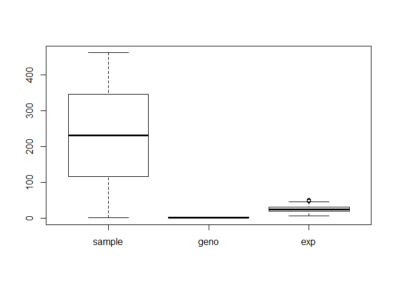

Class 13: Genome Informatics I
================
Quoc Tran
5/14/2019

## Sample genotypes in the MXL 1000 Genome Project Data

``` r
MXL <- read.csv("MXLensembl.csv", header=TRUE)
table(MXL$Genotype..forward.strand.)
```

    ## 
    ## A|A A|G G|A G|G 
    ##  22  21  12   9

``` r
(table((MXL$Genotype..forward.strand.)/nrow(MXL)))*100
```

    ## Warning in Ops.factor((MXL$Genotype..forward.strand.), nrow(MXL)): '/' not
    ## meaningful for factors

    ## numeric(0)

``` r
library(seqinr)
library(gtools)
s2c("DDDDCDEDCDDDDBBDDDCC@")
```

    ##  [1] "D" "D" "D" "D" "C" "D" "E" "D" "C" "D" "D" "D" "D" "B" "B" "D" "D"
    ## [18] "D" "C" "C" "@"

``` r
final <- read.table("final.txt", header=TRUE)
boxplot(final)
```

<!-- -->
