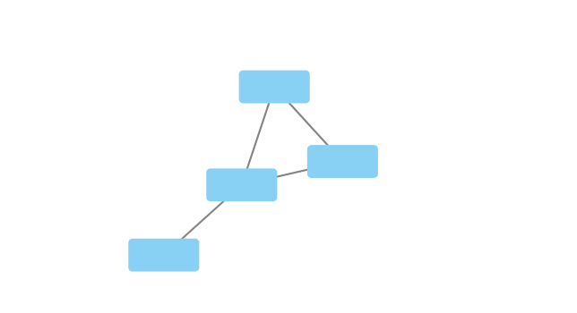
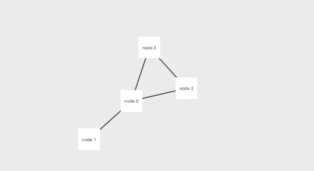

```{r setup, include=FALSE}
knitr::opts_chunk$set(echo = TRUE)
```

```{r}
library(RCy3)
library(igraph)
library(RColorBrewer)
```

```{r}
cytoscapePing()
cytoscapeVersionInfo()
```

```{r}
g <- makeSimpleIgraph()
createNetworkFromIgraph(g,"myGraph")
```

```{r}
fig <- exportImage(filename="demo", type="png", height=350)

```

```{r}
setVisualStyle("Marquee")
fig <- exportImage(filename="demo_marquee", type="png", height=350)

```

```{r}
styles <- getVisualStyleNames()
styles
```

```{r}
setVisualStyle(styles[sample(1:length(styles), 1)]) # sets random style
fig <- exportImage(filename="demo_marquee", type="png", height=350)

```


```{r}
plot(g)
```

```{r}
prok_vir_cor <- read.delim("./data/virus_prok_cor_abundant.tsv", stringsAsFactors = FALSE)
head(prok_vir_cor)
```

```{r}
g <- graph.data.frame(prok_vir_cor, directed = FALSE)
class(g)
g
plot(g)
```

```{r}
plot(g, vertex.label=NA)
```

```{r}
plot(g, vertex.size=3, vertex.label=NA)
```

```{r}
V(g)
```

```{r}
E(g)
```

```{r}
cb <- cluster_edge_betweenness(g)
cb
plot(cb, y=g, vertex.label=NA,  vertex.size=3)
head( membership(cb) )
```

```{r}
d <- degree(g)
hist(d, breaks=30, col="lightblue", main ="Node Degree Distribution")
```

```{r}
plot( degree_distribution(g), type="h" )
```

```{r}
pr <- page_rank(g)
head(pr$vector)
```

```{r}
library("BBmisc")
v.size <- BBmisc::normalize(pr$vector, range=c(2,20), method="range")
plot(g, vertex.size=v.size, vertex.label=NA)
```

```{r}
v.size <- BBmisc::normalize(d, range=c(2,20), method="range")
plot(g, vertex.size=v.size, vertex.label=NA)
```

```{r}
b <- betweenness(g)
v.size <- BBmisc::normalize(b, range=c(2,20), method="range")
plot(g, vertex.size=v.size, vertex.label=NA)
```

```{r}
phage_id_affiliation <- read.delim("./data/phage_ids_with_affiliation.tsv")
head(phage_id_affiliation)
```

```{r}
bac_id_affi <- read.delim("./data/prok_tax_from_silva.tsv", stringsAsFactors = FALSE)
head(bac_id_affi)
```

```{r}
genenet.nodes <- as.data.frame(vertex.attributes(g), stringsAsFactors=FALSE)
head(genenet.nodes)
length( grep("^ph_",genenet.nodes[,1]) )
```

```{r}
z <- bac_id_affi[,c("Accession_ID", "Kingdom", "Phylum", "Class")]
n <- merge(genenet.nodes, z, by.x="name", by.y="Accession_ID", all.x=TRUE)
head(n)
colnames(n)
colnames(phage_id_affiliation)
```

```{r}
y <- phage_id_affiliation[, c("first_sheet.Phage_id_network", "phage_affiliation","Tax_order", "Tax_subfamily")]
x <- merge(x=n, y=y, by.x="name", by.y="first_sheet.Phage_id_network", all.x=TRUE)
x <- x[!duplicated( (x$name) ),]
head(x)
genenet.nodes <- x
```

```{r}
deleteAllNetworks()
colnames(genenet.nodes)[1] <- "id"
genenet.edges <- data.frame(igraph::as_edgelist(g))
colnames(genenet.edges) <- c("source","target")
genenet.edges$Weight <- igraph::edge_attr(g)$weight
createNetworkFromDataFrames(genenet.nodes,genenet.edges, 
                            title="Tara_Oceans")
```

