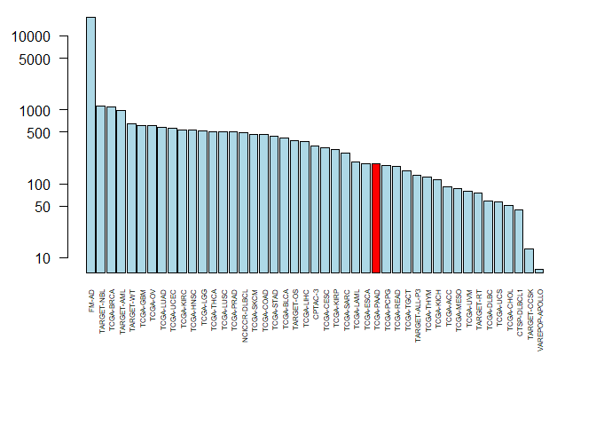

Class 18: Cancer Genomics
================
Quoc Tran
5/30/2019

\#1. The NCI Genomic Data Commons

\#\#Q1. How many Cases (i.e. patient samples) have been found to have
p53 mutations? 4,008 cases

\#\#Q2. What are the top 6 misssense mutations found in this gene?
Missense TP53 R175H, Missense TP53 R273C, Missense TP53 R248Q, Missense
TP53 R273H, Missense TP53 R248W, Missense TP53 R282W

\#\#Q3. Which domain of the protein (as annotated by PFAM) do these
mutations reside in? DNA-binding domain

\#\#Q4. What are the top 6 primary sites (i.e. cancer locations such as
Lung, Brain, etc.) with p53 mutations and how many primary sites have
p53 mutations been found in? Uterus, Ovary, Bronchus, Lung, Pancreas,
Bladder

\#\#Q5. What is the most frequentely mutated position associated with
cancer in the KRas protein (i.e. the amino acid with the most
mutations)? Missense KRAS G12D

\#\#Q6. Are KRas mutations common in Pancreatic Adenocarcinoma (i.e. is
the Pancreas a common ‘primary site’ for KRas mutations?). Yes

\#\#Q6. What is the ‘TGCA project’ with the most KRas mutations?
TCGA-UCEC

\#\#Q7. What precent of cases for this ‘TGCA project’ have KRas
mutations and what precent of cases have p53 mutations? 6 and 25

\#\#Q8. How many TGCA Pancreatic Adenocarcinoma cases (i.e. patients
from the TCGA-PAAD project) have RNA-Seq data available? 177

\#2. The GenomicDataCommons R package

``` r
library(GenomicDataCommons)
```

    ## Loading required package: magrittr

    ## 
    ## Attaching package: 'GenomicDataCommons'

    ## The following object is masked from 'package:stats':
    ## 
    ##     filter

``` r
library(TCGAbiolinks)
```

    ## Registered S3 methods overwritten by 'ggplot2':
    ##   method         from 
    ##   [.quosures     rlang
    ##   c.quosures     rlang
    ##   print.quosures rlang

    ## Registered S3 method overwritten by 'R.oo':
    ##   method        from       
    ##   throw.default R.methodsS3

``` r
library(maftools)
```

``` r
GenomicDataCommons::status()
```

    ## $commit
    ## [1] "e588f035feefee17f562b3a1bc2816c49a2b2b19"
    ## 
    ## $data_release
    ## [1] "Data Release 16.0 - March 26, 2019"
    ## 
    ## $status
    ## [1] "OK"
    ## 
    ## $tag
    ## [1] "1.20.0"
    ## 
    ## $version
    ## [1] 1

\#3. Querying the GDC from R

``` r
cases_by_project <- cases() %>%
  facet("project.project_id") %>%
  aggregations()
head(cases_by_project)
```

    ## $project.project_id
    ##               key doc_count
    ## 1           FM-AD     18004
    ## 2      TARGET-NBL      1127
    ## 3       TCGA-BRCA      1098
    ## 4      TARGET-AML       988
    ## 5       TARGET-WT       652
    ## 6        TCGA-GBM       617
    ## 7         TCGA-OV       608
    ## 8       TCGA-LUAD       585
    ## 9       TCGA-UCEC       560
    ## 10      TCGA-KIRC       537
    ## 11      TCGA-HNSC       528
    ## 12       TCGA-LGG       516
    ## 13      TCGA-THCA       507
    ## 14      TCGA-LUSC       504
    ## 15      TCGA-PRAD       500
    ## 16   NCICCR-DLBCL       489
    ## 17      TCGA-SKCM       470
    ## 18      TCGA-COAD       461
    ## 19      TCGA-STAD       443
    ## 20      TCGA-BLCA       412
    ## 21      TARGET-OS       381
    ## 22      TCGA-LIHC       377
    ## 23        CPTAC-3       322
    ## 24      TCGA-CESC       307
    ## 25      TCGA-KIRP       291
    ## 26      TCGA-SARC       261
    ## 27      TCGA-LAML       200
    ## 28      TCGA-ESCA       185
    ## 29      TCGA-PAAD       185
    ## 30      TCGA-PCPG       179
    ## 31      TCGA-READ       172
    ## 32      TCGA-TGCT       150
    ## 33  TARGET-ALL-P3       131
    ## 34      TCGA-THYM       124
    ## 35      TCGA-KICH       113
    ## 36       TCGA-ACC        92
    ## 37      TCGA-MESO        87
    ## 38       TCGA-UVM        80
    ## 39      TARGET-RT        75
    ## 40      TCGA-DLBC        58
    ## 41       TCGA-UCS        57
    ## 42      TCGA-CHOL        51
    ## 43    CTSP-DLBCL1        45
    ## 44    TARGET-CCSK        13
    ## 45 VAREPOP-APOLLO         7

\#\#Q9. Write the R code to make a barplot of the cases per project.
Lets plot this data with a log scale for the y axis (log=“y”), rotated
axis labels (las=2) and color the bar coresponding to the TCGA-PAAD
project.

``` r
x <- cases_by_project$project.project_id

# Make a custom color vector for our plot
colvec <- rep("lightblue", nrow(x))
colvec[match("TCGA-PAAD",x$key)] <- "red"

# Plot with 'log' for y axis and rotate labels with 'las'
par(las = 2, mar = c(9,4,1,2))  
barplot(x$doc_count, names.arg=x$key, log="y", col=colvec, las=2, cex.names=.5)
```

<!-- -->

\#Section 1. Protein sequences from healthy and tumor tissue

\#\#Q1: Identify sequence regions that contain all 9-mer peptides that
are only found in the tumor

``` r
library("bio3d")
sequences <- read.fasta("lecture18_sequences.fa")
alignment <- seqaln(sequences)
ide <- conserv(alignment)
gaps <- gap.inspect(alignment)$col
ide <- ide[!gaps]
mismatches <- which(ide < 1)
mismatches
```

    ## [1]  41  65 213 259

``` r
fasta_file <- rep.int(0, 17)
for (val in mismatches) {
  fasta_file <- rbind(alignment$ali[2,][(val-8):(val+8)], fasta_file)
}
fasta_file <- fasta_file[c(1:(nrow(fasta_file)-1)),]
fasta_file[fasta_file == "-"] <- ""
write.fasta(seqs = fasta_file, file = "nine_mers")
```

\#Section 2. Patient HLA typing results and HLA binding prediction:

\#\#Q2: Identify 9-mer peptides in the identified sequence regions
unique to the tumor that can be potentially presented to T cells.
